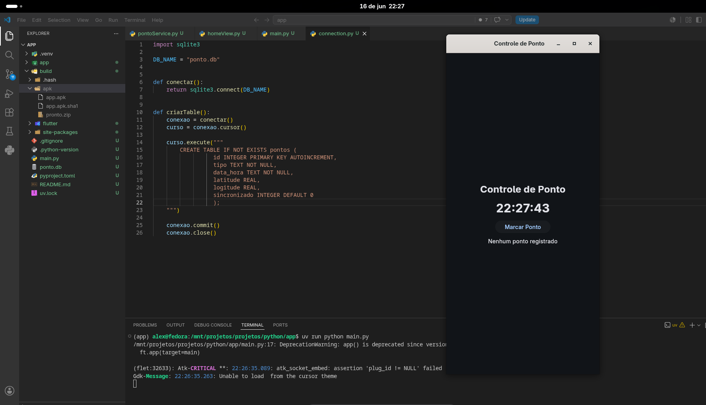
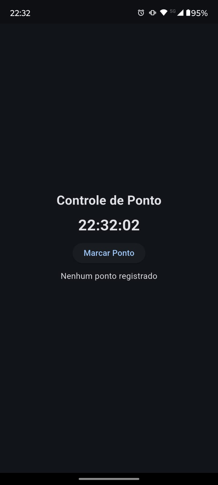

# Controle de Ponto

Aplicação simples de controle de ponto desenvolvida em Python com [Flet](https://flet.dev/). O app exibe um relógio em tempo real, permite marcar o ponto atual e salva cada registro em um banco SQLite local.

## Capturas de Tela





## Funcionalidades

- Relógio atualizado automaticamente a cada segundo.
- Registro de ponto com data e hora atuais.
- Persistência dos registros em banco SQLite local (`ponto.db`).
- Criação automática da tabela `pontos` ao iniciar a aplicação.
- Interface gráfica simples, centralizada e responsiva via Flet.
- Estrutura separada em view, service, model e camada de banco.

## Tecnologias

- Python 3.14 ou superior
- Flet
- SQLite
- uv para gerenciamento de dependências

## Como Executar

### Usando uv

Instale as dependências:

```bash
uv sync
```

Execute a aplicação:

```bash
uv run python main.py
```

### Usando pip

Crie e ative um ambiente virtual:

```bash
python -m venv .venv
source .venv/bin/activate
```

No Windows:

```bash
.venv\Scripts\activate
```

Instale a dependência principal:

```bash
pip install flet
```

Execute a aplicação:

```bash
python main.py
```

## Estrutura do Projeto

```text
.
├── app/
│   ├── database/
│   │   └── connection.py      # Conexão SQLite e criação da tabela pontos
│   ├── models/
│   │   └── Ponto.py           # Modelo de dados do ponto registrado
│   ├── services/
│   │   └── pontoService.py    # Regra para registrar ponto no banco
│   └── views/
│       └── homeView.py        # Tela principal da aplicação
├── build/
│   └── apk/
│       └── app.apk            # Build Android gerado
├── main.py                    # Ponto de entrada da aplicação Flet
├── ponto.db                   # Banco SQLite local
├── pyproject.toml             # Configuração do projeto e dependências
├── uv.lock                    # Lockfile das dependências
├── screenshotDesktop.png      # Captura da versão desktop
├── screenshotSmartPhone.jpeg  # Captura da versão mobile
└── README.md
```

## Como Funciona

Ao iniciar, o `main.py` configura a página Flet, cria a tabela `pontos` caso ela ainda não exista e carrega a `homeView`.

Na tela principal, a função `atualizarRelogio` roda como uma tarefa assíncrona e atualiza o horário exibido a cada segundo. Quando o usuário clica em **Marcar Ponto**, o `PontoSerivce` captura a data e hora atual, grava o registro no SQLite e retorna um objeto `Ponto` para atualizar a mensagem de status na interface.

A tabela `pontos` possui os campos:

```text
id INTEGER PRIMARY KEY AUTOINCREMENT
tipo TEXT NOT NULL
data_hora TEXT NOT NULL
latitude REAL
logitude REAL
sincronizado INTEGER DEFAULT 0
```

## Build Android

O projeto possui um APK gerado em:

```text
build/apk/app.apk
```

Esse arquivo pode ser usado para instalar e testar a versão Android da aplicação.

## Observações

- Os registros são armazenados localmente no arquivo `ponto.db`.
- Os campos `latitude`, `logitude` e `sincronizado` já existem na tabela, mas ainda não são preenchidos pela tela atual.
- A classe e alguns métodos usam os nomes `PontoSerivce` e `registrarPronto`, seguindo a implementação atual do projeto.
